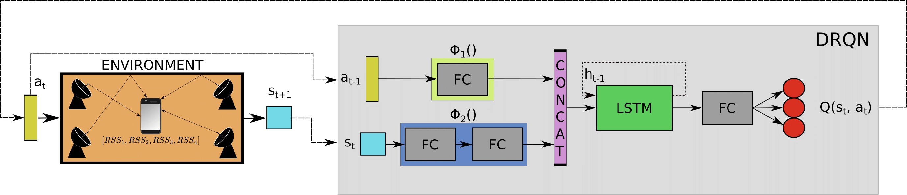

<div align="center">
  
# Recurrent DQN for Radio Fingerprinting <br /> with Constrained Measurements Collection

[Nicola Novello](https://scholar.google.com/citations?user=4PPM0GkAAAAJ&hl=en) and [Andrea M. Tonello](https://scholar.google.com/citations?user=qBiseEsAAAAJ&hl=en)

</div>

Official repository of the paper "Recurrent DQN for Radio Fingerprinting with Constrained Measurements Collection" published at ICT Express (2024). 

> Reinforcement Learning based algorithm to intelligently collect measurements for radio fingerprinting localization in indoor environments.

---

# 📈 Important results from our paper

## Architecture


## Example of path
1st Iter.             |  2nd Iter.  
:-------------------------:|:-------------------------:
  |  
---

# 💻 How to run the code

The folder where the code is located must contain a folder `NetsImages` comprising the following folders: 
- `Datasets` containing the RSSI dataframe obtained after interpolation of the dataset in [https://github.com/beaugunderson/wifi-heatmap](https://github.com/beaugunderson/wifi-heatmap) and the initial training datasets randomly extracted from the same dataset
- `DRQN` containing the saved DRQN
- `FloorImages` containing the map layout
- `OptimalPaths` containing the images of the saved optimal paths traveled by the agent
- `RegModels` containing the saved PPNNs
- `scalers` containing the scaler used to standardize the dataset
- `accuraciesComparison` containing the saved test accuracies

The file `main.py` runs the experiments, while `main_functions.py`, `classes.py`, and `utils.py` comprise the classes and functions needed to run the main script. 

---

## 📝 References

If you use the code for your research, please cite our paper:
```
@article{novello2024recurrent,
  title={Recurrent DQN for radio fingerprinting with constrained measurements collection},
  author={Novello, Nicola and Tonello, Andrea M},
  journal={ICT Express},
  year={2024},
  publisher={Elsevier}
}
```
## 📋 Acknowledgments

The implementation is based on / inspired by:

- [https://github.com/beaugunderson/wifi-heatmap](https://github.com/beaugunderson/wifi-heatmap)
- [https://mlpeschl.com/post/tiny_adrqn/](https://mlpeschl.com/post/tiny_adrqn/)
- [https://github.com/patrickloeber/snake-ai-pytorch](https://github.com/patrickloeber/snake-ai-pytorch)

---

## 📧 Contact

[nicola.novello@aau.at](nicola.novello@aau.at)
